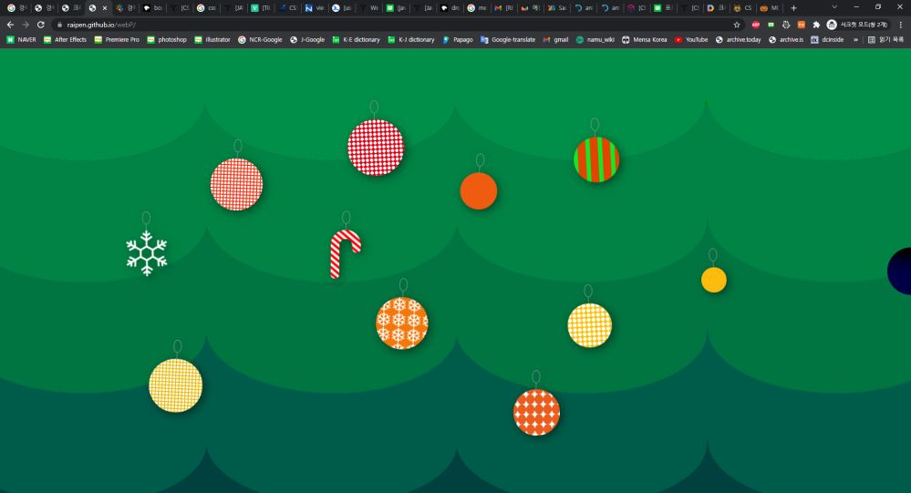
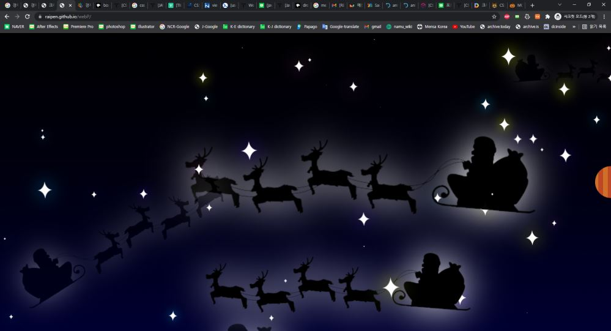
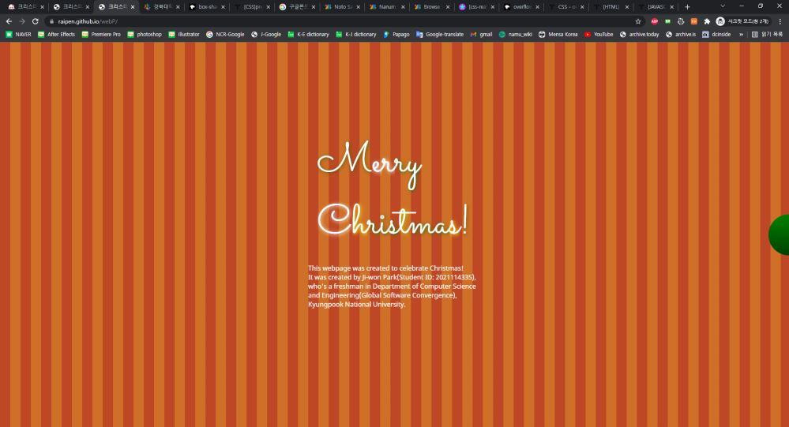

## [\[결과물 바로가기\]](https://raipen.github.io/webP)
## 1. 과제목표

   html, CSS, javascript 만으로 사용자와 상호작용하며 크리스마스 분위기를 느낄 수 있게 해주는 웹페이지 제작을 목표로 과제를 수행하였다. 사용자가 화면을 터치할 때마다 그에 맞는 적절한 동작을 하는 페이지를 제작하여 사용자가 웹페이지를 체험하고 있다는 느낌을 주고 싶었다.

​    

## 2. 개요

   웹페이지는 크게 총 3가지 장면으로 구성되어 있으며, 각 장면의 제목은 “트리 장식하기”, “밤하늘의 산타”, “메리 크리스마스”이다. 한 번에 한 장면씩 보여주며, 다음 장면으로 넘어가는 버튼이 존재한다.

​    

## 3. 개발내용 및 구조

### 3.1. 개발구조

   세 가지 장면을 표시할 div 태그의 id를 각각 "main1, main2, main0"로 구성하였고, 각 장면에서 쓰이는 CSS와 javascript는 "page1\~3.css, page1\~3.js"에 저장되어 있으며, 전체적인 CSS와 js는 “main.css, change_button.js"에 저장되어 있다.

각 장면에 대한 js는 크게 init_main과 loop_main으로 이루어져 있으며 init_main은 웹페이지가 처음 로딩될 때, 실행되며, loop_main은 해당 장면이 선택되었을 때 실행된다.

### 3.2. 개발내용

#### 3.2.1. 장면 전환(change_button.js, main.css)

   장면 전환을 위한 버튼은 화면 크기에 따라 달라진다. 화면의 가로 길이가 800픽셀 이상일 때는 가로로 화면이 넘어가는 느낌을 주기 위해 우측에 화면 전환 버튼이 존재하고, 800픽셀 이하일 때는 세로로 화면이 넘어가는 느낌을 주기 위해 하단에 화면 전환 버튼이 존재한다. 버튼을 클릭하면 changeMain() 함수가 호출되어 현재 장면을 나타내는 div 태그에 disable 클래스를 추가하고, 다음 장면 div 태그에서 disable 클래스와 back 클래스를 삭제한다. 그리고 그 다음 장면 div 태그에 back 클래스를 추가하여 미리 준비를 시킨다. 맨 처음 화면은 장면1부터 시작된다.

#### 3.2.2. 트리 장식하기(page1.js, page1.css)

   장면1을 나타내는 div#main1가 화면 가득 표시된다. 화면에는 흔들리는 나뭇잎들이 존재하며, 화면을 터치하면 해당 위치에 “트리 장식”이 랜덤하게 생성된다. 이때, 생성되는 트리 장식 종류는 cane, snow, ball 3가지가 있으며, ball은 다시 "star", "stripe", "snow", "dot", "none(무늬 존재 X)" 다섯 가지 종류로 나뉜다. 우선 cane과 snow는 해당 위치에 랜덤한 지팡이 모양과 눈 모양 장식이 랜덤한 크기로 생성된다. ball은 해당 위치에 동그란 공 장식이 추가되는데, 이 때 랜덤하게 여러 가지 무늬를 가지고 있다. 그 무늬는 위에서 언급한 다섯 가지 종류이며, 그 무늬들의 크기 또한 랜덤하며, 공 장식 자체의 색깔 또한 붉은 계열과 노란 계열 색상 중에서 랜덤으로 생성된다.  그리고 장식이 많아지면 알아서 한 개씩 떨어질 수 있도록, 장식이 많아질수록 높은 확률로 장식을 떨어뜨리는 함수를 장식을 추가할 때마다 호출한다. 화면을 드래그하면 화면이 흔들린다. 이때 앞서 언급한 장식 삭제 함수를 호출하여 장식 중 하나가 떨어지기도 한다. 그래서 항상 장식은 15개 이하로 유지된다. 이때 장식들이 끈에 매달려 흔들리는 효과를 주기 위해 애니메이션 CSS를 사용하였다.

#### 3.2.3. 밤하늘의 산타(page2.js, page2.css)

   장면2을 나타내는 div#main2가 화면 가득 표시된다. 화면에는 별들이 랜덤한 위치에 랜덤한 크기로 생성되어 반짝거린다. 별들이 너무 화면을 가득 채우지 않도록 최대 50개까지만 생성되고, 그 이후로는 하나씩 삭제 되도록 제작하였다. 그리고 화면을 터치하면 해당 위치를 지나가는 루돌프 썰매를 탄 산타클로스가 등장하도록 하였다. 이때 산타클로스의 경로는, 밑에서 위로, 위에서 밑으로, 수평으로, 밑에서 위로갔다가 밑으로 가는 네 가지 경로 중 랜덤으로 1가지를 선택하게 되며, 각 경로는 왼쪽에서 출발하는 경우와 오른쪽에서 출발하는 경우로 나뉘게 되어, 총 경로는 8가지이다. 산타 또한 CSS를 통해 빛나는 기능을 추가하였다.

#### 3.2.4. 메리 크리스마스(page3.js, page3.css)

   장면3을 나타내는 div#main3가 화면 가득 표시된다. 붉은 빛의 줄무늬 배경에 흰 글씨로 "Merry Cristmas!"가 표시된다. 이때 각 글자를 검은색이 훑고 지나가며, 그 훑고 지나간 속도는 랜덤이다. 그리고 그 속도로 각 글자들 테두리의 색상이 변화하며 빛나는 효과를 준다. 그리고 각 글자들을 클릭하면, 그 글자만 다시 검은색 로딩이 진행되고, 테두리 색상 변화 속도가 랜덤하게 바뀐다. "Merry Cristmas!" 하단에는 웹페이지에 대한 소개를 추가하였다. 

​    

## 4. 결과 및 사용법

### 4.1. 장면1

    

   화면을 클릭하면 랜덤한 장식들이 생성된다. 장식들이 많아지면 장식들이 하나 둘 떨어진다. 화면에서 마우스를 클릭한 채로 드래그하면 화면이 흔들리면서 장식이 떨어지기도 한다. 우측(화면 너비 800픽셀 이상)이나 하단(화면 너비 800픽셀 이하)에 존재하는 밤하늘 색상의 반원을 클릭하면 다음 장면으로 넘어간다.

### 4.2 장면 2

    

   화면에 별들이 반짝이고 있다. 화면을 터치하면 해당 위치를 지나가는 산타가 랜덤한 경로로 나타난다. 우측(화면 너비 800픽셀 이상)이나 하단(화면 너비 800픽셀 이하)에 존재하는 빨간색 줄무늬의 반원을 클릭하면 다음 장면으로 넘어간다.

### 4.3 장면 3

  

   줄무늬 화면에 "Merry Cristmas!" 글자가 반짝거린다. 각 글자를 클릭하면 그 글자가 검은색에서 흰색으로 랜덤한 시간동안 로딩되며, 그 시간에 비례하는 속도로 색상이 변화하도록 색상 변화 속도가 변경된다. 하단에는 웹페이지의 소개가 있다. 우측(화면 너비 800픽셀 이상)이나 하단(화면 너비 800픽셀 이하)에 존재하는 초록색의 반원을 클릭하면 첫번째 장면으로 넘어간다.

​    
